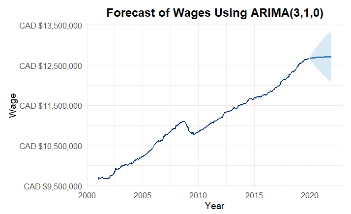
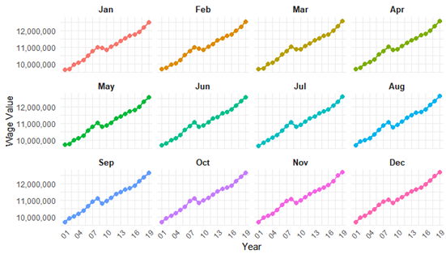

# Time Series Forecasting (R) – Canadian Wages

## Overview
This project applies time series forecasting techniques to monthly wage data (2001–2019). The goal is to build and evaluate forecasting models and communicate results in a clear, decision-oriented way.

## Results
- Selected **ARIMA(3,1,0)** based on **AIC/BIC** and **residual diagnostics**
- Evaluated using **1-step-ahead rolling forecasts** with **MSFE** and **MAFE**
- Compared candidate models using the **Diebold–Mariano test**
- Produced forecasts with **prediction intervals** to support decision-making

## Key Visuals
### Forecast (ARIMA)

  

### Seasonality by Month

  

## Tools
- R (forecasting, diagnostics, evaluation)
- Excel (light preprocessing)

## Key Methods
- Data preparation: log transformation and differencing to support stationarity
- Model development: ARIMA (and seasonal alternatives)
- Diagnostics: residual checks and model adequacy review
- Evaluation: one-step-ahead rolling forecast and error metrics (MSFE, MAFE)
- Model comparison: statistical testing (Diebold–Mariano test)

## Deliverables
- Project report (PDF)
- Key plots (added in the `images/` folder)

## How to Review Quickly
1. Open the project report PDF in this repo.
2. Review the plots in `images/` (summary visuals).
3. Skim the model evaluation section for final model selection and results.
